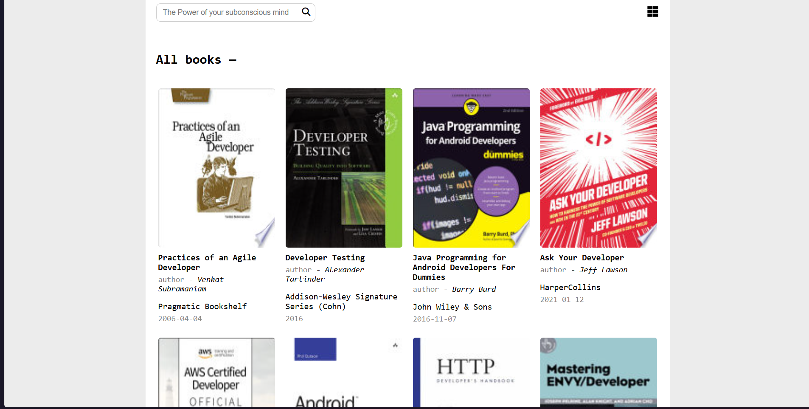
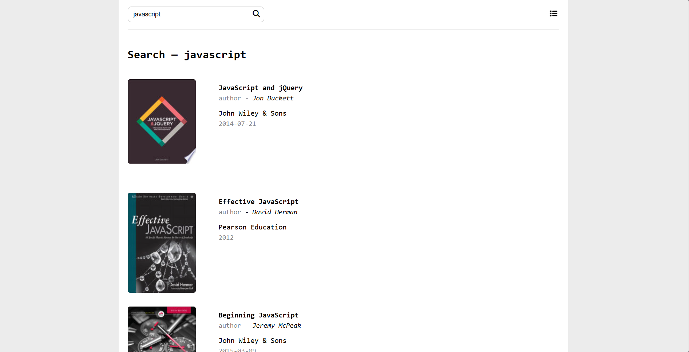
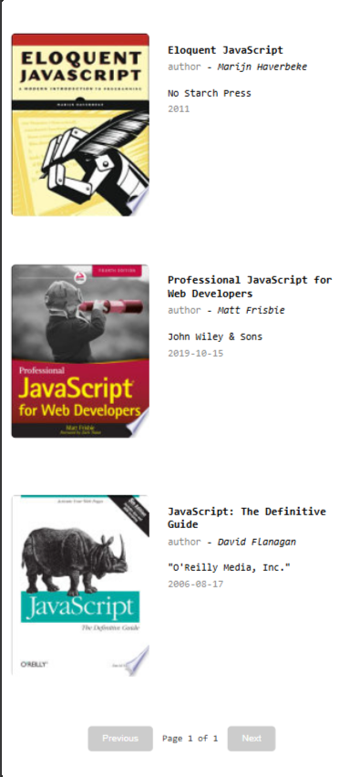

# Books Library

A simple web application that displays books from an API. Users can view books in either a grid or list layout, search for specific titles or authors, and see additional details for each book.

## Tech Stack

- HTML **(for icons fontawsome)**
- CSS
- JavaScript

## Features

1. **Book Listing**

   - Displays books in a grid or list view, switchable via a toggle button.

   - Shows the book’s thumbnail, title, author, publisher, and published date.

2. Search Functionality

   - Users can type into a search bar to filter books by title or author.

   - Debouncing is implemented to prevent excessive API calls.

3. Pagination

   - Displays up to 10 books per page.

   - Provides “Next” and “Previous” buttons to navigate between pages.

4. Book Details

   - Clicking on a book reveals a detailed view with more information, such as subtitle and description.

   - Includes a “Back” button to return to the main list.

5. Responsive Design

   - Adjusts layout for smaller screens (container goes full width on mobile).

## Screenshots

## Deployment

This application is deployed on Vercel. You can access the live application <https://masterji-assignments-eta.vercel.app/JS>[ Assignment 3/index.html](https://masterji-assignments-eta.vercel.app/JS%20Assignment%204/index.html).
