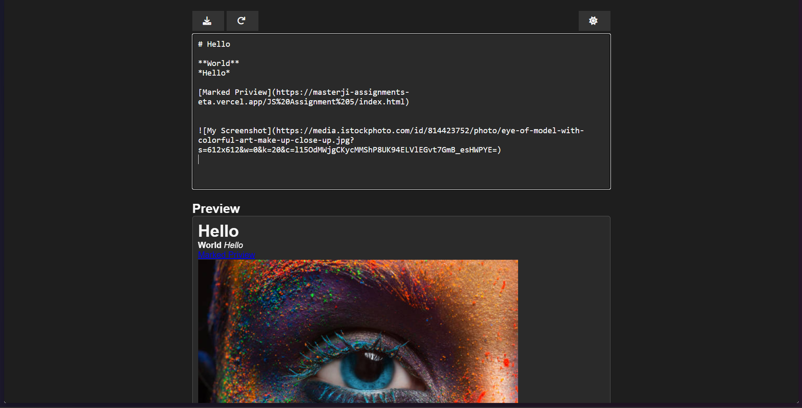
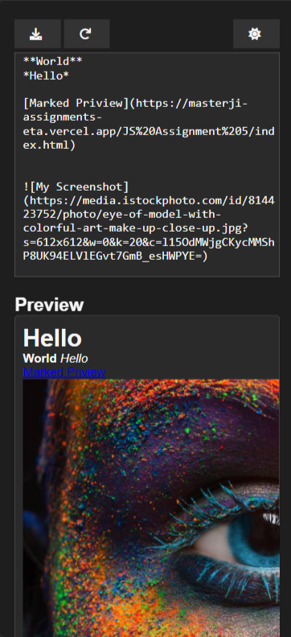

# Markdown Previewer

A simple Markdown previewer that lets you type Markdown text and see the rendered HTML in real-time. The application also provides theme switching, content reset, and the ability to download your Markdown as a file.

## Features

- **Live Markdown Preview:**  
  Type your Markdown in the textarea and see the rendered HTML instantly.

- **Theme Toggle:**  
  Switch between dark and light themes with a single click.

- **Content Persistence:**  
  Your Markdown content is saved in localStorage, so your work remains even after a page refresh.

- **Reset Functionality:**  
  Quickly clear the Markdown content and preview by clicking the reset button.

- **Download Markdown:**  
  Download your current Markdown as a `.md` file.

## Technologies Used

- **HTML5** – For the page markup.
- **CSS** – For styling and responsive design.
- **JavaScript** – For functionality, including event handling, localStorage usage, and theme toggling.
- **Marked.js** – A lightweight Markdown parser that converts Markdown text into HTML.
- **Font Awesome** – For icons used in the buttons.

## Screenshots

## Deployment

This application is hosted on Your Hosting PlatformVercel. You can access the live site here.
[Marked Priview](https://masterji-assignments-eta.vercel.app/JS%20Assignment%205/index.html)
